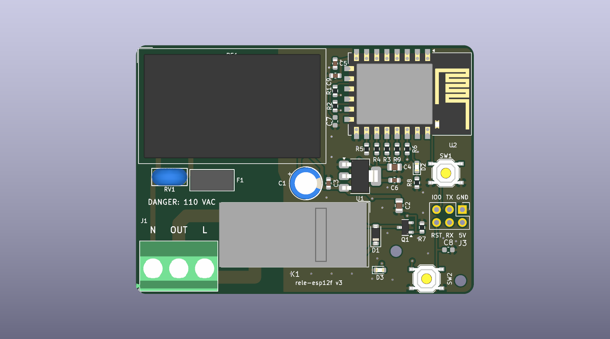
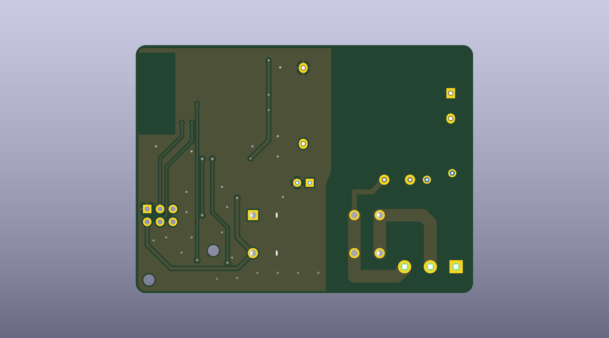
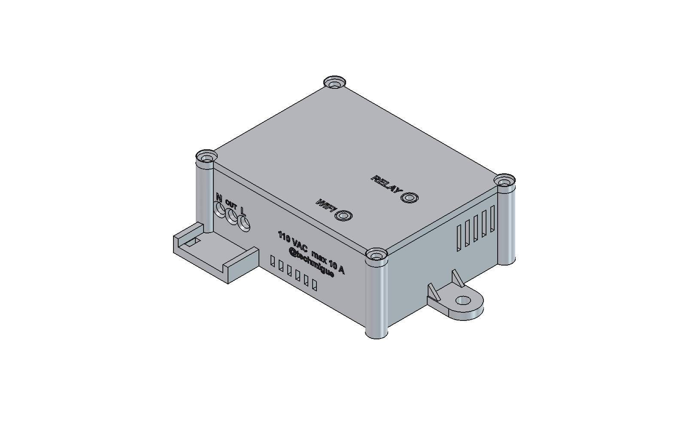
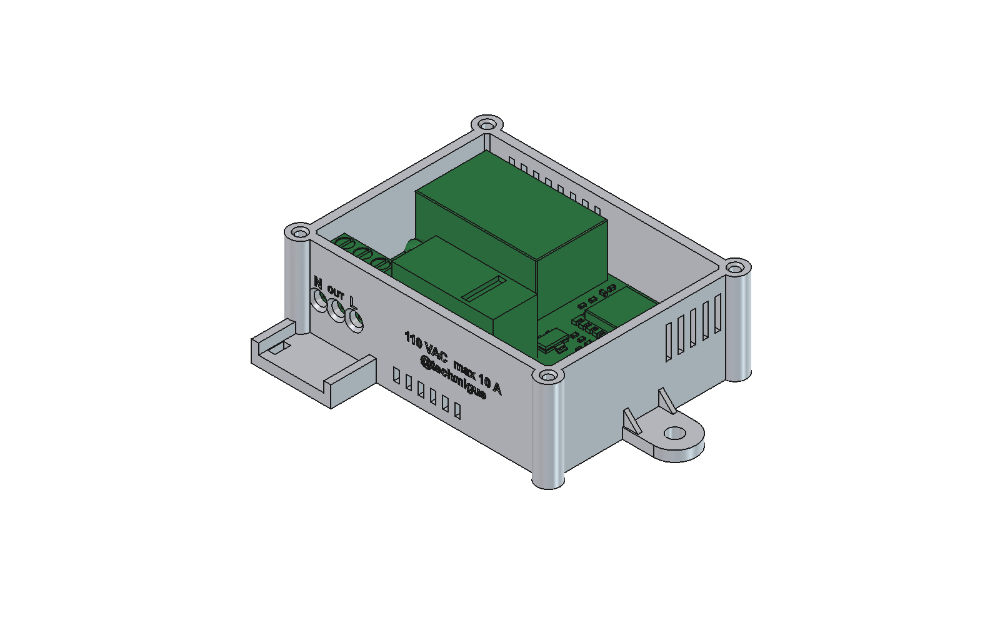

# SmartRele · rele-esp12f

**Single-channel Wi-Fi relay module based on the ESP-12F (ESP8266) for 110–120 VAC mains.**


<p align="center">
  
  
</p>

A 2-layer, **66.5 × 49 mm** board that switches a mains load of up to **10 A** from an ESP-12F. It is powered directly from the mains through an isolated HLK-PM01 supply and integrates input protection (time-lag fuse and varistor), a 16 A Omron G5RL power relay, status indicators and a programming header. All components sit on the top side, and the board is ready to be ordered **fully assembled from JLCPCB** (SMD and THT), with no hand soldering.

> [!WARNING]
> This design operates at **mains voltage**. Assembly, testing and installation must be carried out by qualified people. Read the [Safety](#safety) section before connecting the board.

---

## Table of contents
- [Features](#features)
- [Specifications](#specifications)
- [Architecture](#architecture)
- [Connectors and pinout](#connectors-and-pinout)
- [Repository layout](#repository-layout)
- [Manufacturing and assembly](#manufacturing-and-assembly)
- [First firmware flashing](#first-firmware-flashing)
- [Enclosure](#enclosure)
- [Design verification](#design-verification)
- [Safety](#safety)
- [Documentation](#documentation)
- [License](#license)

## Features
- **ESP-12F** with the antenna at the board edge and a copper-free area underneath.
- **Omron G5RL-1A-E-HR relay** (SPST-NO, 16 A / 250 VAC) with 8 mm coil-to-contact separation (reinforced insulation per the manufacturer).
- **Strict mains / low-voltage zoning** enforced by custom design rules: 4 mm between mains and low voltage, 2 mm between mains nets. Measured minimum clearance: 4.35 mm.
- **Duplicated power path** on both sides (2 × 2.5 mm, 35 µm), sized for 10 A with a ~12 °C temperature rise (IPC-2221).
- **Input protection**: T500mA time-lag fuse (protects the supply) and 07D221K varistor.
- **Robust start-up**: RC delay on EN and RST, 10 µF + 100 nF decoupling next to the module, and the relay held open during reset.
- **Indicators** for relay (red) and Wi-Fi (blue); user/boot (GPIO0) and reset push buttons.
- **Programming** through a 2×3 header powered at 5 V; OTA updates afterwards.
- **Complete manufacturing package**: Gerbers, drill files, BOM and CPL ready for JLCPCB, with 3D models for every part.
- **3D-printable enclosure**, parametric and checked against the 3D model of the assembled board.

## Specifications

| Parameter | Value |
|---|---|
| Input voltage | 110–120 VAC, 50/60 Hz |
| Maximum load | 10 A resistive (trace limit; relay 16 A, terminal block 18 A) |
| Contact | SPST-NO, switches the line (L) |
| On-board supply | HLK-PM01, 5 V / 600 mA, isolated |
| Regulator | AMS1117-3.3 |
| Microcontroller | ESP8266 (ESP-12F module), Wi-Fi 802.11 b/g/n |
| Protection | F1 T500mA 250 V (supply branch) · RV1 07D221K |
| PCB | 66.5 × 49 × 1.6 mm, 2 layers, 35 µm copper |
| Assembly | Single-sided; 32 components, all factory-assembled |
| Mounting holes | 2 × M2 (MH1, MH2), in the low-voltage zone |

The full datasheet, with test conditions and the source of each value, is in [`docs/rele-esp12f_datasheet_user_guide.pdf`](docs/rele-esp12f_datasheet_user_guide.pdf).

## Architecture

```
 Power      J1:L ──────────► K1 contact (COM → NO) ──────────► J1:OUT ──► load

 Supply     J1:L ── F1 ── L_F ──► PS1 HLK-PM01 ──► +5 V ── U1 AMS1117 ──► +3.3 V ──► U2 ESP-12F
                          RV1 between L_F and N

 Control    +5 V ── K1 coil (D1 flyback diode) ── Q1 SS8050 ── GND
                                                   ▲
                                        GPIO5 (U2) ── R6 1 kΩ
```

- **Mains zone** (bottom left): J1, F1, RV1, K1 and the PS1 input.
- **Low-voltage zone** (right): U1 and its capacitors, relay driver, LEDs, push buttons, J3 and mounting holes. GND planes on both sides, restricted to this zone.
- **Top strip**: PS1 on the left and the ESP-12F with its antenna on the right edge.

The full schematic is in [`docs/schematic.pdf`](docs/schematic.pdf).

## Connectors and pinout

### J1 — Mains terminal block (3 poles, 5.08 mm pitch)
| Pin | Signal | Function |
|:-:|---|---|
| 1 | N | Neutral |
| 2 | OUT | Switched output to the load |
| 3 | L | Line input |

### J3 — Programming (2×3 header, 2.54 mm pitch)
```
 IO0   TX   GND(1)
 RST   RX   5V
```
Pin 1 (square pad) = GND; pin 2 = 5 V. Labeled on the silkscreen.

### ESP-12F
| GPIO | Function |
|---|---|
| GPIO5 | Relay (SS8050, R6 1 kΩ, R7 10 kΩ to GND) and relay LED (D2) |
| GPIO4 | Wi-Fi LED (D3) |
| GPIO0 | Push button SW1 (flashing mode / application use), 10 kΩ to 3.3 V |
| GPIO2 | 10 kΩ to 3.3 V (boot strap) |
| GPIO15 | 10 kΩ to GND (boot strap) |
| EN, RST | 10 kΩ to 3.3 V + 100 nF to GND; RST also to SW2 |

## Repository layout

```
.
├── rele-esp12f.kicad_pro      KiCad 10 project
├── rele-esp12f.kicad_sch      Schematic
├── rele-esp12f.kicad_pcb      PCB layout
├── rele-esp12f.kicad_dru      Custom design rules (mains isolation)
├── 3dmodels/                  STEP models missing from the KiCad library (K1, F1, SW1/SW2)
├── fabrication/               Production package for JLCPCB
│   ├── gerbers/               Gerbers and drill files (Excellon)
│   ├── gerbers_JLCPCB.zip     Gerbers + drill files + CPL, ready to upload
│   ├── BOM_JLCPCB.csv         Bill of materials with LCSC part numbers
│   └── CPL_JLCPCB.csv         Component placement list
├── docs/
│   ├── schematic.pdf
│   ├── rele-esp12f_datasheet_user_guide.pdf
│   ├── pcb_top.png · pcb_bottom.png
│   └── datasheets/            Datasheets of the key components
├── enclosure/                 3D-printable enclosure (FreeCAD, STEP, STL)
├── scripts/                   PDF datasheet generator
├── CHANGELOG.md
└── LICENSE
```

The custom 3D models are referenced through `${KIPRJMOD}/3dmodels/`, so the project opens without any extra path configuration.

## Manufacturing and assembly

1. Upload [`fabrication/gerbers_JLCPCB.zip`](fabrication/gerbers_JLCPCB.zip) to JLCPCB (2 layers, 1.6 mm).
2. Enable **PCB Assembly** (top side) and upload [`BOM_JLCPCB.csv`](fabrication/BOM_JLCPCB.csv) and [`CPL_JLCPCB.csv`](fabrication/CPL_JLCPCB.csv).
3. Before paying, check in the JLCPCB viewer that:
   - U2 and K1 sit on their pads;
   - the J1 wire entry faces the board edge;
   - J3 pin 1 lands on the square pad (GND);
   - every BOM line has a part selected.

THT parts are wave-soldered. The CPL uses the **pad center** (JLCPCB convention), not the body center; for U2 and K1 they differ. The drill holes of J1 (Ø1.5 mm) and RV1 (Ø1.0 mm) are matched to the actual parts.

### Power and THT components

| Ref. | Part | LCSC | Notes |
|---|---|---|---|
| PS1 | Hi-Link HLK-PM01 | C209903 | Isolated 5 V supply |
| K1 | Omron G5RL-1A-E-HR DC5 | C113250 | SPST-NO 16 A; 5 V coil, 80 mA |
| F1 | Reomax MTS0500A, T500mA 250 V | C2762401 | Time-lag, due to the PS1 inrush current |
| RV1 | Varistor 07D221K | C49072913 | For 110–120 VAC |
| C1 | 470 µF 10 V | C112505 | |
| J1 | KANGNEX WJ500V-5.08-3P | C72334 | 250 V / 18 A |
| J3 | 2×3 header, 2.54 mm | C65114 | Only used for the first flashing |

The full list is in the [BOM](fabrication/BOM_JLCPCB.csv).

### Regenerating the production files

With `kicad-cli` (KiCad 10), from the repository root:

```bash
kicad-cli pcb export gerbers --layers F.Cu,B.Cu,F.SilkS,B.SilkS,F.Mask,B.Mask,F.Paste,Edge.Cuts -o fabrication/gerbers/ rele-esp12f.kicad_pcb
```

```bash
kicad-cli pcb export drill --format excellon --excellon-units mm --excellon-separate-th --excellon-zeros-format decimal -o fabrication/gerbers/ rele-esp12f.kicad_pcb
```

```bash
kicad-cli pcb render --side top -w 1592 -h 904 --background opaque --quality basic --zoom 0.9954 -o docs/pcb_top.png rele-esp12f.kicad_pcb
```

```bash
kicad-cli pcb render --side bottom -w 1592 -h 904 --background opaque --quality basic --zoom 0.9954 -o docs/pcb_bottom.png rele-esp12f.kicad_pcb
```

These explicit options are needed because the plot settings stored in the board produce `.gbr` extensions and an unnecessary B.Paste layer. The ZIP contains the 11 files in `fabrication/gerbers/` plus `CPL_JLCPCB.csv`.

## First firmware flashing

1. **Disconnect the board from mains.**
2. Connect a USB-serial adapter with **3.3 V logic** to J3: TX↔RX, RX↔TX, GND, and its **5 V (VBUS)** output to the 5V pin.
3. Hold SW1 (GPIO0) while pressing and releasing SW2 (RST) to enter flashing mode.
4. Flash the firmware. Later updates are done over the air (OTA).

J3 is powered at 5 V rather than 3.3 V for two reasons. The internal output-to-input diode of the AMS1117 would make the adapter also feed the 5 V rail. In addition, the 3.3 V pin of a typical adapter cannot supply the current peaks the ESP8266 draws while calibrating its radio.

Firmware is not part of this repository. The [datasheet](docs/rele-esp12f_datasheet_user_guide.pdf) includes example configurations for Tasmota and ESPHome.

## Enclosure

The [`enclosure/`](enclosure/) folder contains a two-part enclosure (base and screwed lid) for 3D printing in PETG or ASA/ABS. It is generated by a parametric FreeCAD script, and its interference with the 3D model of the assembled board is zero. Design, printing and assembly details are in [`enclosure/README.md`](enclosure/README.md).

<p align="center">
  
  
</p>

## Design verification

Results with `kicad-cli` 10.0.5, with all zones refilled:

| Check | Errors | Warnings | Warning details |
|---|:-:|:-:|---|
| DRC | **0** | 29 | 23 footprints modified from the library (J1/RV1 drills and custom 3D models); 6 PS1/J1 silkscreen items next to the rounded corners |
| Schematic ↔ PCB parity | **0** | 34 | 32 LCSC/assembly fields not copied to footprints; 2 mounting holes without a symbol |
| ERC | **0** | 9 | Off-grid endpoints and symbols that differ from the library |
| Unconnected pads | **0** | — | |

None of the warnings affects manufacturing. Measured clearances: mains copper ↔ low voltage ≥ 4.35 mm on both sides; mains copper ↔ board edge ≥ 2.0 mm.

## Safety

- **110–120 VAC mains.** The 07D221K varistor is rated for that voltage. For 230 VAC it must be replaced (e.g. with a 07D471K). F1 is suitable for both voltages.
- **The load current does not flow through F1**, which only protects the supply. Install a circuit breaker or fuse of **≤ 10 A** upstream, dedicated to this output. An on-board fuse would not have enough breaking capacity for a mains short circuit.
- **Never connect J3 while the board is connected to mains.**
- Mount the board in an **insulating enclosure**: mains copper is 2 mm from the board edge.
- Use only **MH1 and MH2** (low-voltage zone) for metal hardware: M2 screws with a head or washer of Ø ≤ 5 mm.
- The printed enclosure provides mechanical and contact protection, but it is **not certified**. For a permanent installation, print it in a flame-retardant material or place it inside an approved electrical junction box.

## Documentation

| Document | Contents |
|---|---|
| [Datasheet and user guide](docs/rele-esp12f_datasheet_user_guide.pdf) | Specifications, operation, installation and design rationale |
| [Schematic](docs/schematic.pdf) | Full schematic in PDF |
| [Datasheets](docs/datasheets/) | Omron G5RL, AMS1117, ESP8266EX, ESP-WROOM-02 and the Espressif hardware design guidelines |
| [Changelog](CHANGELOG.md) | Hardware revisions and the rationale behind each change |
| [Enclosure](enclosure/README.md) | Enclosure design, printing and assembly |

The datasheet is regenerated with `python scripts/generate_datasheet.py` (requires ReportLab, PyMuPDF, Pillow and `kicad-cli`).

## License

Hardware released under the **CERN Open Hardware Licence v2 – Weakly Reciprocal** ([CERN-OHL-W-2.0](LICENSE)).

Inspired by [aman983/ESP-01S_Relay_Module](https://github.com/aman983/ESP-01S_Relay_Module). This is a new design and contains no files from the original.

---

© 2026 [@techmigue](https://github.com/techmiguel)
