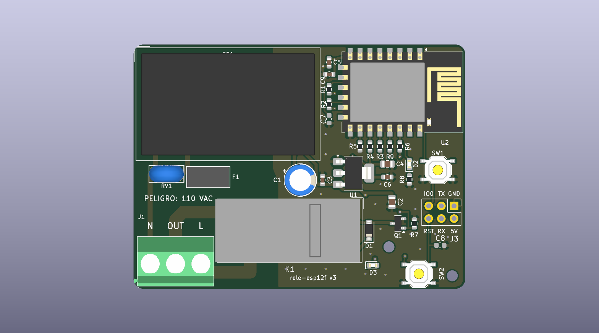
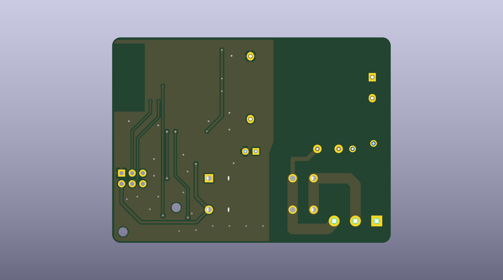

# SmartRele · rele-esp12f

**Módulo de relé Wi-Fi monocanal basado en ESP-12F (ESP8266) para redes de 110–120 VAC.**


<p align="center">
  
  
</p>

Placa de 2 capas y **66,5 × 49 mm** que conmuta una carga de red de hasta **10 A** desde un ESP-12F. Se alimenta directamente de la red mediante una fuente aislada HLK-PM01 e integra protección de entrada (fusible de acción retardada y varistor), relé de potencia Omron G5RL de 16 A, indicadores de estado y conector de programación. Todos los componentes van en la cara superior y la placa está preparada para pedirse **montada completa en JLCPCB** (SMD y THT), sin soldadura manual.

> [!WARNING]
> Este diseño trabaja con **tensión de red**. Su montaje, prueba e instalación deben hacerlos personas cualificadas. Lee la sección [Seguridad](#seguridad) antes de conectar la placa.

---

## Índice
- [Características](#características)
- [Especificaciones](#especificaciones)
- [Arquitectura](#arquitectura)
- [Conectores y asignación de pines](#conectores-y-asignación-de-pines)
- [Estructura del repositorio](#estructura-del-repositorio)
- [Fabricación y montaje](#fabricación-y-montaje)
- [Primer grabado del firmware](#primer-grabado-del-firmware)
- [Chasis](#chasis)
- [Verificación del diseño](#verificación-del-diseño)
- [Seguridad](#seguridad)
- [Documentación](#documentación)
- [Licencia](#licencia)

## Características
- **ESP-12F** con la antena en el borde de la placa y zona sin cobre bajo ella.
- **Relé Omron G5RL-1A-E-HR** (SPST-NO, 16 A / 250 VAC) con 8 mm de separación bobina–contacto (aislamiento reforzado según el fabricante).
- **Zonificación estricta red / baja tensión** con reglas de diseño propias: 4 mm entre red y baja tensión y 2 mm entre redes de red. Separación mínima medida: 4,35 mm.
- **Camino de potencia duplicado** en ambas caras (2 × 2,5 mm, 35 µm) dimensionado para 10 A con unos 12 °C de calentamiento (IPC-2221).
- **Protección de entrada**: fusible T500mA de acción retardada (protege a la fuente) y varistor 07D221K.
- **Arranque robusto**: retardo RC en EN y RST, desacoplo 10 µF + 100 nF junto al módulo, y relé abierto durante el reset.
- **Indicadores** de relé (rojo) y Wi-Fi (azul); pulsadores de usuario/arranque (GPIO0) y reset.
- **Programación** por header 2×3 alimentado a 5 V; después, actualizaciones OTA.
- **Paquete de fabricación completo**: Gerbers, taladros, BOM y CPL listos para JLCPCB, con modelos 3D de todas las piezas.
- **Chasis imprimible** en 3D, paramétrico y verificado contra el modelo 3D de la placa montada.

## Especificaciones

| Parámetro | Valor |
|---|---|
| Tensión de entrada | 110–120 VAC, 50/60 Hz |
| Carga máxima | 10 A resistiva (límite de las pistas; relé 16 A, borna 18 A) |
| Contacto | SPST-NO, conmuta la fase (L) |
| Fuente interna | HLK-PM01, 5 V / 600 mA, aislada |
| Regulador | AMS1117-3.3 |
| Microcontrolador | ESP8266 (módulo ESP-12F), Wi-Fi 802.11 b/g/n |
| Protección | F1 T500mA 250 V (rama de la fuente) · RV1 07D221K |
| PCB | 66,5 × 49 × 1,6 mm, 2 capas, cobre 35 µm |
| Montaje | Una sola cara; 32 componentes, todos montados en fábrica |
| Taladros de fijación | 2 × M2 (MH1, MH2), en la zona de baja tensión |

La hoja de datos completa, con condiciones de medida y origen de cada valor, está en [`docs/rele-esp12f_datasheet_guia_usuario.pdf`](docs/rele-esp12f_datasheet_guia_usuario.pdf).

## Arquitectura

```
 Potencia   J1:L ──────────► K1 contacto (COM → NO) ──────────► J1:OUT ──► carga

 Fuente     J1:L ── F1 ── L_F ──► PS1 HLK-PM01 ──► +5 V ── U1 AMS1117 ──► +3,3 V ──► U2 ESP-12F
                          RV1 entre L_F y N

 Control    +5 V ── bobina K1 (D1 en antiparalelo) ── Q1 SS8050 ── GND
                                                       ▲
                                            GPIO5 (U2) ── R6 1 kΩ
```

- **Zona de red** (abajo a la izquierda): J1, F1, RV1, K1 y la entrada de PS1.
- **Zona de baja tensión** (derecha): U1 y sus condensadores, driver del relé, LEDs, pulsadores, J3 y taladros de fijación. Planos de GND en ambas caras, limitados a esta zona.
- **Franja superior**: PS1 a la izquierda y el ESP-12F con la antena en el borde derecho.

El esquemático completo está en [`docs/esquematico.pdf`](docs/esquematico.pdf).

## Conectores y asignación de pines

### J1 — Borna de red (3 polos, paso 5,08 mm)
| Pin | Señal | Función |
|:-:|---|---|
| 1 | N | Neutro |
| 2 | OUT | Salida conmutada hacia la carga |
| 3 | L | Fase de entrada |

### J3 — Programación (header 2×3, paso 2,54 mm)
```
 IO0   TX   GND(1)
 RST   RX   5V
```
Pin 1 (pad cuadrado) = GND; pin 2 = 5 V. Rotulado en la serigrafía.

### ESP-12F
| GPIO | Función |
|---|---|
| GPIO5 | Relé (SS8050, R6 1 kΩ, R7 10 kΩ a GND) y LED de relé (D2) |
| GPIO4 | LED de Wi-Fi (D3) |
| GPIO0 | Pulsador SW1 (modo de grabado / uso de aplicación), 10 kΩ a 3,3 V |
| GPIO2 | 10 kΩ a 3,3 V (arranque) |
| GPIO15 | 10 kΩ a GND (arranque) |
| EN, RST | 10 kΩ a 3,3 V + 100 nF a GND; RST también a SW2 |

## Estructura del repositorio

```
.
├── rele-esp12f.kicad_pro      Proyecto KiCad 10
├── rele-esp12f.kicad_sch      Esquemático
├── rele-esp12f.kicad_pcb      Placa
├── rele-esp12f.kicad_dru      Reglas de diseño personalizadas (aislamiento de red)
├── 3dmodels/                  Modelos STEP ausentes en la librería de KiCad (K1, F1, SW1/SW2)
├── fabricacion/               Paquete de producción para JLCPCB
│   ├── gerbers/               Gerbers y taladros (Excellon)
│   ├── gerbers_JLCPCB.zip     Gerbers + taladros + CPL, listo para subir
│   ├── BOM_JLCPCB.csv         Lista de materiales con referencias LCSC
│   └── CPL_JLCPCB.csv         Posiciones de montaje
├── docs/
│   ├── esquematico.pdf
│   ├── rele-esp12f_datasheet_guia_usuario.pdf
│   ├── pcb_superior.png · pcb_inferior.png
│   └── datasheets/            Hojas de datos de los componentes principales
├── chasis/                    Caja imprimible (FreeCAD, STEP, STL)
├── scripts/                   Generación de la hoja de datos en PDF
├── CHANGELOG.md
└── LICENSE
```

Los modelos 3D propios se referencian con `${KIPRJMOD}/3dmodels/`, por lo que el proyecto se abre sin configurar rutas adicionales.

## Fabricación y montaje

1. Sube [`fabricacion/gerbers_JLCPCB.zip`](fabricacion/gerbers_JLCPCB.zip) a JLCPCB (2 capas, 1,6 mm).
2. Activa **PCB Assembly** (montaje en la cara superior) y carga [`BOM_JLCPCB.csv`](fabricacion/BOM_JLCPCB.csv) y [`CPL_JLCPCB.csv`](fabricacion/CPL_JLCPCB.csv).
3. Antes de pagar, revisa en el visor de JLCPCB que:
   - U2 y K1 encajan sobre sus pads;
   - la entrada de cable de J1 mira hacia el borde de la placa;
   - el pin 1 de J3 cae en el pad cuadrado (GND);
   - todas las líneas de la BOM tienen pieza seleccionada.

Las piezas THT se sueldan por ola. El CPL usa el **centro de los pads** (convención de JLCPCB), no el centro del cuerpo; en U2 y K1 ambos difieren. Los taladros de J1 (Ø1,5 mm) y RV1 (Ø1,0 mm) están ajustados a las piezas reales.

### Componentes de potencia y THT

| Ref. | Pieza | LCSC | Observaciones |
|---|---|---|---|
| PS1 | Hi-Link HLK-PM01 | C209903 | Fuente aislada 5 V |
| K1 | Omron G5RL-1A-E-HR DC5 | C113250 | SPST-NO 16 A; bobina 5 V, ~106 mA |
| F1 | Reomax MTS0500A, T500mA 250 V | C2762401 | Acción retardada, por el pico de arranque de PS1 |
| RV1 | Varistor 07D221K | C49072913 | Para 110–120 VAC |
| C1 | 470 µF 10 V | C112505 | |
| J1 | KANGNEX WJ500V-5.08-3P | C72334 | 250 V / 18 A |
| J3 | Header 2×3, 2,54 mm | C65114 | Solo para el primer grabado |

La lista completa está en la [BOM](fabricacion/BOM_JLCPCB.csv).

### Regenerar los archivos de producción

Con `kicad-cli` (KiCad 10), desde la raíz del repositorio:

```bash
kicad-cli pcb export gerbers --layers F.Cu,B.Cu,F.SilkS,B.SilkS,F.Mask,B.Mask,F.Paste,Edge.Cuts -o fabricacion/gerbers/ rele-esp12f.kicad_pcb
```

```bash
kicad-cli pcb export drill --format excellon --excellon-units mm --excellon-separate-th --excellon-zeros-format decimal -o fabricacion/gerbers/ rele-esp12f.kicad_pcb
```

```bash
kicad-cli pcb render --side top -w 1592 -h 904 --background opaque --quality basic --zoom 0.9954 -o docs/pcb_superior.png rele-esp12f.kicad_pcb
```

```bash
kicad-cli pcb render --side bottom -w 1592 -h 904 --background opaque --quality basic --zoom 0.9954 -o docs/pcb_inferior.png rele-esp12f.kicad_pcb
```

Se usan estas opciones explícitas porque los ajustes de trazado guardados en la placa generan extensiones `.gbr` y una capa B.Paste innecesaria. El ZIP contiene los 11 archivos de `fabricacion/gerbers/` más `CPL_JLCPCB.csv`.

## Primer grabado del firmware

1. **Desconecta la placa de la red.**
2. Conecta un adaptador USB-serie con **lógica de 3,3 V** a J3: TX↔RX, RX↔TX, GND y su salida de **5 V (VBUS)** al pin 5V.
3. Mantén pulsado SW1 (GPIO0) mientras pulsas y sueltas SW2 (RST) para entrar en modo de grabado.
4. Graba el firmware. Las actualizaciones posteriores se hacen por OTA.

J3 se alimenta a 5 V y no a 3,3 V por dos motivos. El diodo interno del AMS1117 entre salida y entrada haría que el adaptador cargase también el rail de 5 V. Además, el pin de 3,3 V de un adaptador típico no aguanta los picos de corriente del ESP8266 al calibrar la radio.

El firmware no forma parte de este repositorio.

## Chasis

La carpeta [`chasis/`](chasis/) contiene una caja de dos piezas (base y tapa atornillada) para impresión 3D en PETG o ASA/ABS. Está generada con un script paramétrico de FreeCAD y su interferencia con el modelo 3D de la placa montada es nula. Detalles de diseño, impresión y montaje en [`chasis/README.md`](chasis/README.md).

<p align="center">
  
  
</p>

## Verificación del diseño

Resultados con `kicad-cli` 10.0.5 y las zonas rellenadas de nuevo:

| Comprobación | Errores | Avisos | Detalle de los avisos |
|---|:-:|:-:|---|
| DRC | **0** | 29 | 23 huellas modificadas respecto a la librería (taladros de J1/RV1 y modelos 3D propios); 6 de serigrafía de PS1/J1 junto a las esquinas redondeadas |
| Paridad esquemático ↔ PCB | **0** | 34 | 32 campos LCSC/montaje no copiados a las huellas; 2 taladros de fijación sin símbolo |
| ERC | **0** | 9 | Extremos fuera de rejilla y símbolos distintos de la librería |
| Pads sin conectar | **0** | — | |

Ningún aviso afecta a la fabricación. Separaciones medidas: cobre de red ↔ baja tensión ≥ 4,35 mm en ambas caras; cobre de red ↔ borde ≥ 2,0 mm.

## Seguridad

- **Red de 110–120 VAC.** El varistor 07D221K está dimensionado para esa tensión. Para 230 VAC hay que sustituirlo (p. ej. por un 07D471K). F1 sirve para ambas tensiones.
- **La carga no pasa por F1**, que solo protege a la fuente. Instala aguas arriba un magnetotérmico o un fusible de **≤ 10 A** dedicado a esta salida. Un fusible de placa no tiene poder de corte suficiente para un cortocircuito de red.
- **Nunca conectes J3 con la placa conectada a la red.**
- Monta la placa en una **caja aislante**: el cobre de red queda a 2 mm del borde.
- Usa solo **MH1 y MH2** (zona de baja tensión) para tornillería metálica: M2 con cabeza o arandela de Ø ≤ 5 mm.
- El chasis impreso proporciona protección mecánica y contra contactos, pero **no está certificado**. Para una instalación fija, imprímelo en un material ignífugo o alójalo en una caja de registro homologada.

## Documentación

| Documento | Contenido |
|---|---|
| [Hoja de datos y guía de usuario](docs/rele-esp12f_datasheet_guia_usuario.pdf) | Especificaciones, funcionamiento, instalación y criterios de diseño |
| [Esquemático](docs/esquematico.pdf) | Esquemático completo en PDF |
| [Hojas de datos](docs/datasheets/) | Omron G5RL, AMS1117, ESP8266EX, ESP-WROOM-02 y guía de diseño hardware de Espressif |
| [Historial de cambios](CHANGELOG.md) | Revisiones del hardware y criterios de cada cambio |
| [Chasis](chasis/README.md) | Diseño, impresión y montaje de la caja |

La hoja de datos se regenera con `python scripts/generar_datasheet.py` (requiere ReportLab, PyMuPDF, Pillow y `kicad-cli`).

## Licencia

Hardware publicado bajo la **CERN Open Hardware Licence v2 – Weakly Reciprocal** ([CERN-OHL-W-2.0](LICENSE)).

Inspirado en [aman983/ESP-01S_Relay_Module](https://github.com/aman983/ESP-01S_Relay_Module). Es un diseño nuevo que no incluye archivos del original.

---

© 2026 [@techmigue](https://github.com/techmiguel)
