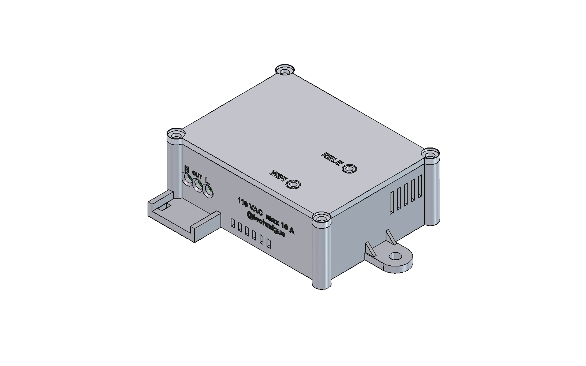
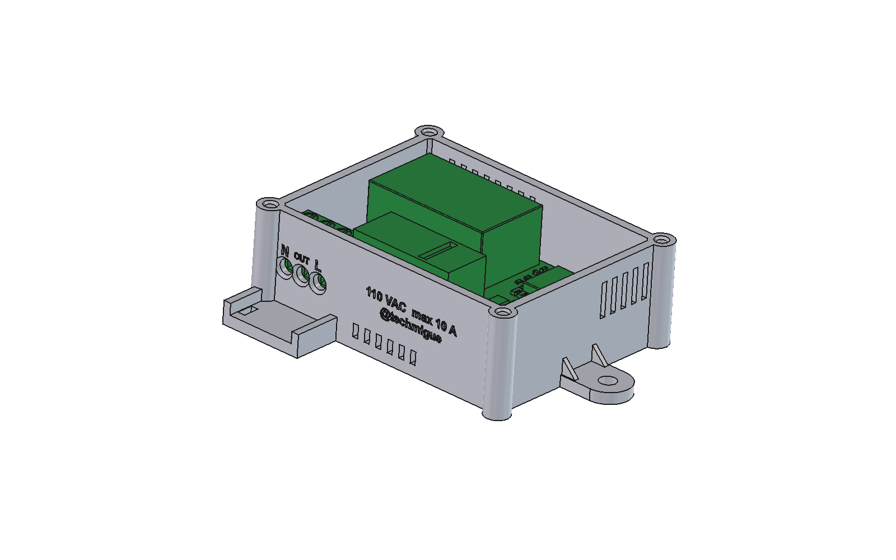

# Chasis imprimible — rele-esp12f v3

Caja de dos piezas: base y tapa atornillada. Hecha en FreeCAD a partir del modelo 3D real del PCB montado.




## Archivos
| Archivo | Contenido |
|---|---|
| `stl/chasis_base.stl` | Base. Ya orientada para imprimir (suelo sobre la cama). |
| `stl/chasis_tapa.stl` | Tapa. Ya volteada (cara superior sobre la cama). |
| `chasis_rele-esp12f.FCStd` | Documento FreeCAD con las piezas en posición de montaje y el PCB de referencia. |
| `chasis_rele-esp12f_ensamblado.step` | Base y tapa en posición de montaje, sin el PCB. |
| `rele-esp12f_pcb.step` | PCB con componentes, exportado de KiCad. Se usa para comprobar el encaje. |
| `generar_chasis.py` | Script paramétrico que genera todo lo anterior. |

Regenerar (desde la carpeta del proyecto, con FreeCAD abierto):
```
kicad-cli pcb export step --subst-models --force --user-origin 100x149mm -o chasis/rele-esp12f_pcb.step rele-esp12f.kicad_pcb
```
y en la consola Python de FreeCAD: `exec(open(r"<ruta>/chasis/generar_chasis.py", encoding="utf-8").read())`.

## Medidas
- Exterior: 77,5 × 60 × 28,5 mm (solo la caja; con las orejetas y el alivio de tracción, 101,9 × 70,2 mm).
- Interior: 67,1 × 49,6 mm, es decir, el PCB + 0,3 mm de holgura por lado. Pared de 2,4 mm, suelo de 2,0 mm y tapa de 2,5 mm.
- PCB a 5 mm sobre el suelo. Las patillas THT más largas (las de PS1) asoman 3,3 mm por debajo, así que quedan 1,7 mm de aire.
- Techo a 1,7 mm sobre el relé K1, que es la pieza más alta (15,7 mm sobre el PCB).

## Criterios de diseño
- **Encaje medido, no estimado.** Todas las cotas salen del STEP exportado de KiCad. El script comprueba la intersección de cada pieza con los 87 sólidos del PCB montado: el volumen de interferencia es **0**. J3 no tiene modelo 3D en la librería, así que se comprobó a mano: sus pines llegan a unos 17 mm de altura y la tapa empieza en 23,5 mm (faldón).
- **Sujeción del PCB.** La placa solo tiene dos taladros (MH1 y MH2), y los dos están en la esquina inferior derecha. Con solo dos tornillos, la placa podría girar o levantarse por el lado de red. Por eso:
  - Abajo, apoya en una repisa perimetral de 1,5 mm (pisa 1,2 mm de borde), en las torretas M2 de MH1/MH2 y en dos pilares situados justo debajo de SW1 y SW2. Así, al pulsarlos con la tapa quitada, la placa no se flexiona.
  - Arriba, cuatro pisadores de la tapa bajan hasta 0,2 mm del PCB en zonas sin componentes: borde izquierdo entre J1 y PS1, borde superior entre PS1 y el ESP, borde inferior bajo K1 y borde derecho junto a SW1. Dos topes más quedan a 0,5 mm de PS1 y de K1. Si se aflojan los tornillos, la placa no puede moverse más de 0,2 mm.
  - Los tornillos metálicos solo entran por MH1/MH2. Esos taladros están en la zona de baja tensión, como exige el README del PCB.
- **Tapa atornillada (4 × M3), no a presión.** En un equipo con tensión de red, abrirlo debe requerir herramienta. Las columnas de los tornillos están fuera del contorno del PCB, a 0,64 mm de sus esquinas redondeadas. Un faldón de 2,5 mm centra la tapa en la base.
- **Entrada de red.** Hay tres taladros de Ø3,8 mm con avellanado exterior, alineados con las entradas de cable de J1. Se midieron en el modelo 3D: centro a 5,1 mm sobre la cara inferior del PCB y paso de 5,08 mm. Están rotulados N · OUT · L, igual que la borna. Delante hay un delantal con dos ranuras para una brida de alivio de tracción: un tirón del cable no debe llegar nunca a la borna.
- **Sin pulsadores en la tapa.** SW1 (GPIO0) y SW2 (RST) son solo de depuración: quedan dentro y se pulsan con la tapa quitada. Cada agujero y cada pieza móvil de menos en una caja de red es una vía menos de entrada de polvo o de un objeto. Si el firmware usara SW1 para conmutar el relé a mano, habría que volver a añadir a la tapa una guía y un vástago encima de SW1.
- **LEDs.** D2 y D3 son SMD 0603 y están a 1,1 mm del PCB. Unos tubos de Ø2,6 mm bajan desde la tapa hasta 1,5 mm por encima de cada LED, para que la luz de uno no se vea por el agujero del otro. Los agujeros siguen sobre los LEDs, que están en diagonal (7,3 mm en X y 20,3 mm en Y). Para que el marcado se lea ordenado sin moverlos, se repite el mismo módulo en cada LED:
  - un anillo grabado concéntrico al agujero, de Ø4,2 a Ø5,2 mm;
  - el rótulo, del mismo tamaño (2,6 mm) y con el mismo número de letras (RELE / WiFi), alineado a la derecha a la misma distancia del anillo y centrado en la altura del agujero.
  Para que se vean mejor, el tubo puede rellenarse con una gota de resina transparente o con un trozo de filamento transparente de 1,75 mm.
- **Ventilación por convección.** El aire entra por ranuras bajas en el frente (bajo el PCB, junto al relé) y sale por ranuras altas detrás (sobre PS1) y en el lateral derecho. Todas miden **1,5 mm** de ancho, de modo que no pasa una sonda de 2,5 mm (IP3X en ese aspecto; no se ha ensayado).
- **Antena.** Sobre la antena del ESP-12F solo hay plástico; en esa zona no hay tornillos ni piezas metálicas. Las orejetas de fijación están en los extremos: el taladro de la derecha tiene su centro a 11,7 mm del borde del PCB, a media altura de la placa.

## Rótulos (grabados a 0,5–0,6 mm)
- Tapa: solo RELE y WiFi, junto a sus LEDs.
- Frente: N · OUT · L sobre los cables, y debajo, en dos líneas, «110 VAC  max 10 A» y «@techmigue».
- Fondo: «Smart Rele», legible al dar la vuelta a la caja.

## Impresión
- **Material: PETG o ASA/ABS.** Nada de PLA: dentro de la caja, PS1 y la bobina del relé (~0,5 W) calientan, y el PLA se deforma a partir de unos 55 °C.
- Capa de 0,2 mm, 4 perímetros (las paredes de 2,4 mm quedan macizas), 25–30 % de relleno gyroid. **No necesita soportes**: todos los voladizos son puentes de ≤ 3,8 mm o chaflanes de 45°.
- Las mallas STL se verificaron cerradas, sin aristas no-manifold y sin autointersecciones.

## Montaje
Tornillería: 4 × M3×10 autorroscante (tapa), 2 × M2×6 autorroscante (PCB), 2 × M4 para fijar la caja y 1 brida de 3,6 mm.
1. Atornillar el PCB a la base por MH1 y MH2 (M2×6, sin apretar en exceso: es plástico).
2. Pasar los cables por los taladros frontales y apretarlos en J1 (N · OUT · L, de izquierda a derecha vistos de frente). Sujetarlos al delantal con la brida.
3. Cerrar la tapa y poner los 4 tornillos M3.

## Avisos de seguridad (leer)
- Los filamentos comunes (PETG, ASA, ABS) **no son autoextinguibles** (no son UL94 V-0). Para una instalación fija conectada a la red, la práctica correcta es una de estas:
  - imprimir en un material ignífugo (PC-FR, ABS-FR o PETG V0);
  - meter este chasis dentro de una caja de registro eléctrica homologada.
  Este chasis da protección mecánica y contra contactos, pero no está certificado.
- **No conectar el adaptador USB-serie (J3) con la placa conectada a la red.** J3 queda dentro de la caja a propósito: solo se usa con la tapa quitada y la red desconectada.
- La protección contra sobrecorriente de la carga sigue siendo aguas arriba: magnetotérmico o fusible de ≤ 10 A (ver el README del proyecto).
