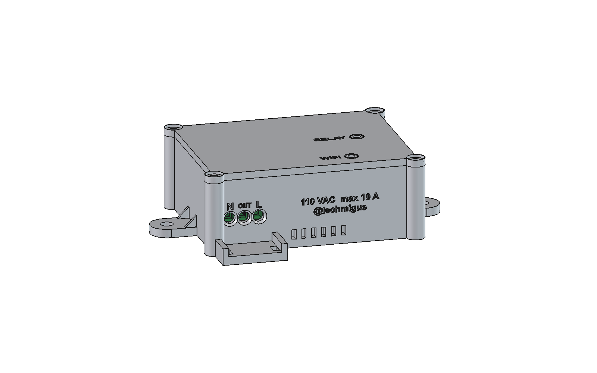
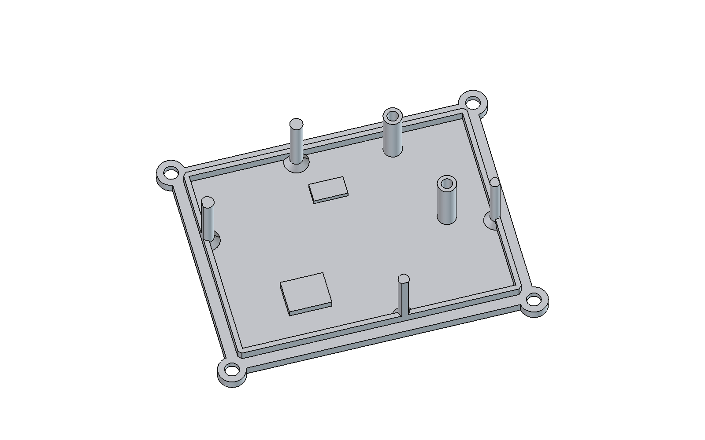

# 3D-printable enclosure — rele-esp12f v3

Two-part enclosure: base and screwed lid. Designed in FreeCAD from the real 3D model of the assembled PCB.

<p align="center">
  
  
</p>
<p align="center">
  
  
</p>

## Files
| File | Contents |
|---|---|
| `stl/enclosure_base.stl` | Base, already oriented for printing (floor on the bed). |
| `stl/enclosure_lid.stl` | Lid, already flipped (top face on the bed). |
| `enclosure_rele-esp12f.FCStd` | FreeCAD document with the parts in assembly position and the reference PCB. |
| `enclosure_rele-esp12f_assembly.step` | Base and lid in assembly position, without the PCB. |
| `rele-esp12f_pcb.step` | Assembled PCB exported from KiCad. Used to check the fit. |
| `generate_enclosure.py` | Parametric script that generates all of the above. |
| `img/` | Renders: closed, open with PCB, front, top, bottom and lid inside. |

To regenerate, from the repository root:
```bash
kicad-cli pcb export step --subst-models --force --user-origin 100x149mm -o enclosure/rele-esp12f_pcb.step rele-esp12f.kicad_pcb
```
```bash
freecadcmd enclosure/generate_enclosure.py
```
It can also be run from the FreeCAD Python console (with the repository root as the working directory): `exec(open(r"enclosure/generate_enclosure.py", encoding="utf-8").read())`.

## Dimensions
- Outside: 77.5 × 60 × 28.5 mm (box only; 101.9 × 70.2 mm including the mounting tabs and the strain-relief apron).
- Inside: 67.1 × 49.6 mm, i.e. the PCB plus 0.3 mm of clearance per side. 2.4 mm walls, 2.0 mm floor and 2.5 mm lid.
- PCB 5 mm above the floor. The longest THT leads (PS1) protrude 3.3 mm below the board, leaving a 1.7 mm air gap.
- Ceiling 1.7 mm above relay K1, the tallest part (15.7 mm above the PCB).

## Design criteria
- **Measured fit, not estimated.** Every dimension comes from the STEP exported by KiCad. The script checks the intersection of each part with the 87 solids of the assembled PCB: the interference volume is **0**. J3 has no 3D model in the library, so it was checked by hand: its pins reach about 17 mm and the lid starts at 23.5 mm (skirt).
- **PCB retention.** The board only has two mounting holes (MH1 and MH2), both in the bottom-right corner. With only two screws the board could rotate or lift on the mains side. Therefore:
  - Below, it rests on a 1.5 mm perimeter ledge (supporting 1.2 mm of the board edge), on the M2 standoffs of MH1/MH2 and on two pillars located right under SW1 and SW2, so the board does not flex when they are pressed with the lid removed.
  - Above, four lid posts come down to 0.2 mm from the PCB in component-free areas: left edge between J1 and PS1, top edge between PS1 and the ESP, bottom edge under K1 and right edge next to SW1. Two more stops sit 0.5 mm above PS1 and K1. Even if the screws loosen, the board cannot move more than 0.2 mm.
  - Metal screws only go through MH1/MH2. These holes are in the low-voltage zone, as required by the PCB README.
- **Screwed lid (4 × M3), not snap-fit.** On mains equipment, opening the enclosure must require a tool. The screw bosses are outside the PCB outline, 0.64 mm from its rounded corners. A 2.5 mm skirt centers the lid on the base.
- **Mains entry.** Three Ø3.8 mm holes with an outer countersink, aligned with the J1 wire entries. They were measured on the 3D model: center 5.1 mm above the PCB bottom face and 5.08 mm pitch. They are labeled N · OUT · L, matching the terminal block. In front there is an apron with two slots for a cable tie that provides strain relief: pulling the cable must never reach the terminal block.
- **No buttons on the lid.** SW1 (GPIO0) and SW2 (RST) are for debugging only: they stay inside and are pressed with the lid removed. Every hole and moving part removed from a mains enclosure is one less entry path for dust or objects. If the firmware used SW1 to toggle the relay by hand, a guide and a plunger above SW1 would have to be added to the lid.
- **LEDs.** D2 and D3 are 0603 SMD parts, 1.1 mm above the PCB. Ø2.6 mm light pipes come down from the lid to 1.5 mm above each LED, so the light of one LED is not visible through the other's hole. The holes stay above the LEDs, which are placed diagonally (7.3 mm in X and 20.3 mm in Y). To keep the marking tidy without moving them, the same module is repeated for each LED:
  - an engraved ring concentric with the hole, from Ø4.2 to Ø5.2 mm;
  - the label (RELAY / WiFi), same size (2.6 mm), right-aligned at the same distance from the ring and vertically centered on the hole.
  For better visibility, the pipe can be filled with a drop of clear resin or a piece of clear 1.75 mm filament.
- **Convection cooling.** Air enters through low slots at the front (below the PCB, next to the relay) and leaves through high slots at the back (above PS1) and on the right side. All slots are **1.5 mm** wide, so a 2.5 mm probe cannot pass (IP3X in that respect; not tested).
- **Antenna.** Only plastic covers the ESP-12F antenna; there are no screws or metal parts in that area. The mounting tabs are at both ends: the right-hand hole is 11.7 mm from the PCB edge, at mid-height of the board.

## Labels (engraved 0.5–0.6 mm deep)
- Lid: only RELAY and WiFi, next to their LEDs.
- Front: N · OUT · L above the cables and, below, on two lines, "110 VAC  max 10 A" and "@techmigue".
- Bottom: "Smart Rele" (product name), readable when the enclosure is turned over.

## Printing
- **Material: PETG or ASA/ABS.** Not PLA: inside the enclosure, PS1 and the relay coil (~0.5 W) produce heat, and PLA deforms from about 55 °C.
- 0.2 mm layers, 4 perimeters (the 2.4 mm walls come out solid), 25–30 % gyroid infill. **No supports needed**: all overhangs are bridges of ≤ 3.8 mm or 45° chamfers.
- The STL meshes were verified to be closed, with no non-manifold edges and no self-intersections.

## Assembly
Hardware: 4 × M3×10 self-tapping (lid), 2 × M2×6 self-tapping (PCB), 2 × M4 to mount the enclosure and 1 × 3.6 mm cable tie.
1. Screw the PCB to the base through MH1 and MH2 (M2×6, do not overtighten: it is plastic).
2. Pass the cables through the front holes and tighten them in J1 (N · OUT · L, left to right seen from the front). Secure them to the apron with the cable tie.
3. Close the lid and fit the 4 M3 screws.

## Safety notes (read)
- Common filaments (PETG, ASA, ABS) are **not self-extinguishing** (not UL94 V-0). For a permanent mains installation, the correct practice is one of:
  - printing in a flame-retardant material (PC-FR, ABS-FR or PETG V0);
  - placing this enclosure inside an approved electrical junction box.
  This enclosure provides mechanical and contact protection, but it is not certified.
- **Do not connect the USB-serial adapter (J3) while the board is connected to mains.** J3 is deliberately left inside the enclosure: it is only used with the lid removed and mains disconnected.
- Overcurrent protection for the load must still be installed upstream: a circuit breaker or fuse of ≤ 10 A (see the project README).
